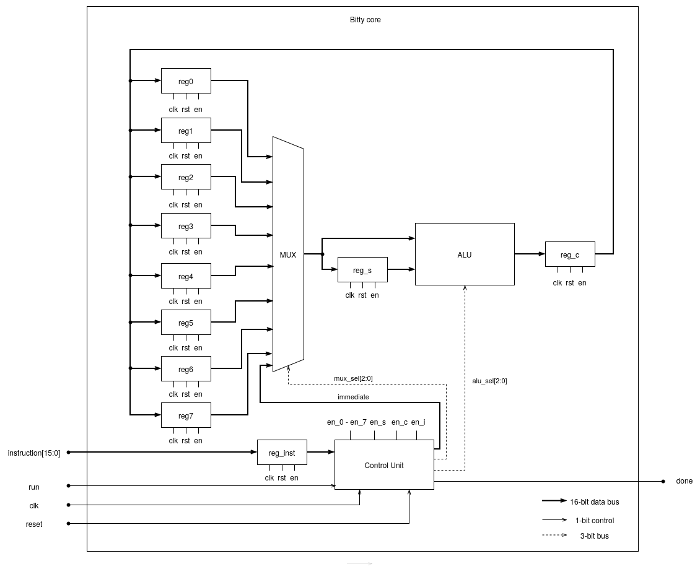

# Bitty — 16-bit Microprocessor Implementation in Verilog HDL

Bitty is a 16-bit microprocessor architecture designed by Dr. Nursultan Kabylkas at Nazarbayev University.
This repository contains a complete RTL implementation of the processor in Verilog HDL, along with a C++ software emulator and a module-level verification suite written from scratch.

The project demonstrates end-to-end hardware/software co-design: the RTL and the emulator independently execute the same instruction set, and their outputs are cross-validated at runtime via a SystemVerilog DPI-C interface.

---

## Architecture Overview


The processor is built from five RTL modules that together implement a simple but complete fetch-decode-execute pipeline:

| Module | File | Description |
|---|---|---|
| Core | `rtl/bitty_core.v` | Top-level integration of all submodules; drives the pipeline |
| Control Unit | `rtl/control_unit.v` | 4-state FSM (start → fetch → execute → writeback); decodes instruction fields and asserts register enable signals |
| ALU | `rtl/alu.v` | 8-operation 16-bit ALU: add, sub, AND, OR, XOR, logical shift left/right, and compare |
| Register File | `rtl/register.v` | Eight 16-bit general-purpose registers (R0–R7) plus dedicated accumulator (RC), source (RS), and instruction (RI) registers |
| Multiplexer | `rtl/mux.v` | 9-input source selector; routes one of eight register values or an 8-bit immediate into the ALU input |

### Instruction Encoding

Instructions are 16 bits wide. The control unit decodes them as follows:

| Bits | Field | Description |
|---|---|---|
| `[15:13]` | Destination register | Selects which register receives the result |
| `[12:10]` | Source register | Selects second operand (register mode) |
| `[12:5]` | Immediate value | 8-bit immediate operand (immediate mode) |
| `[4:2]` | ALU operation | Selects one of 8 ALU operations |
| `[1]` | Reserved | Reserved bit to implement further functionalities of RISC-V architecture|
| `[0]` | Operand mode | `0` = register-register, `1` = register-immediate |

### Final-State Machine

Each instruction executes in four clock cycles:

```
start  →  state0 (fetch source register into RS)
       →  state1 (execute: ALU computes result into RC)
       →  state2 (writeback: RC written to destination register, done asserted)
       →  start
```

---

## Module Design Notes

The processor follows reduced instruction set design principles: fixed-width 16-bit instructions, a small general-purpose register file, and a clean separation between computation and control.
Each module is intentionally minimal and single-responsibility.

### Register (`rtl/register.v`)
A single positive-edge-triggered D flip-flop with synchronous-reset-on-reset and write-enable gating. 
All eleven registers in the design (R0–R7, RC, RS, RINST) are instances of this same module — the entire state of the processor is stored uniformly. 
The active-high `reset` forces the output to zero asynchronously; the `en` signal ensures a register only drives a new value when the control unit explicitly permits it, 
preventing unitended writes during other stages.

### ALU (`rtl/alu.v`)
A combinational module with no internal state. 
It supports eight operations selected by a 3-bit control signal: addition, subtraction, bitwise AND/OR/XOR, logical left and right shifts, and a three-way compare (returns 0 if equal, 1 if A > B, 2 if A < B). The compare operation is the most semantically rich — it produces a value that the software emulator can use to implement conditional branching at a higher level.

### Multiplexer (`rtl/mux.v`)
A 9-to-1 combinational selector with a 4-bit select line. Inputs `in0`–`in7` map directly to the eight general-purpose registers; `in8` carries the zero-extended 8-bit immediate extracted by the control unit. Selecting `4'b1000` switches the ALU's B-input from a register value to the immediate, implementing the register-immediate instruction mode without any additional datapath hardware.

### Control Unit (`rtl/control_unit.v`)
A Moore FSM with four states driving all register enable signals, the ALU operation select, and the mux select. 
The state register is sequential (clocked). The four states map directly onto the pipeline:

- **start** — asserts `en_i` to drive the incoming instruction into RINST
- **state0** — asserts `en_s` and sets `mux_sel` to load the source operand into RS
- **state1** — asserts `en_c` and sets `alu_sel`; the ALU result is latched into RC; immediate mode is handled here by switching `mux_sel` to `4'b1000`
- **state2** — decodes `instruction[15:13]` to assert exactly one of `en_0`–`en_7`, writing RC into the destination register; asserts `done`

All enable signals default to zero at the top of the output block, so only explicitly asserted signals are ever active to avoid unintended register writes.

### Top-Level Core (`rtl/bitty_core.v`)
Instantiates all submodules and wires them together. 
Notable structural decisions: RC feeds back into all eight general-purpose registers' 
`d_in` simultaneously — the destination is selected purely by which `en` signal the control unit asserts, not by routing multiplexer. 
The DPI-C call `emuInit()` is triggered on the falling edge of `done`, which fires exactly once per completed instruction, making it a clean synchronization point for the emulator cross-check.

---

## Hardware/Software Co-Verification via DPI-C

A key design decision in this project is the use of **SystemVerilog Direct Programming Interface (DPI-C)** to bridge the RTL simulation and a C++ software emulator.

On every falling edge of `done`, the RTL calls `emuInit()` — a C function exported from `dpi/bitty_dpi.cpp` — passing the current instruction and the value just written by the hardware. 
The emulator independently evaluates the same instruction and compares its result against the hardware output, flagging any discrepancy.

---

## C++ Emulator

The emulator (`emulator/bitty_emu.cpp`) implements the Bitty core in software. 
It maintains its own register file and executes instructions independently of the RTL, serving as the golden reference model during simulation.

```cpp
class BittyEmulator{
public:
    BittyEmulator();

    ~BittyEmulator(){
        printStats();
    }

    uint16_t Evaluate(uint16_t instruction);
    uint16_t GetRegisterValue(uint16_t reg_num);
    void printStats();

private:
    std::vector<uint16_t> registers;
    size_t num_tests = 0;
};
```

---

## Verification

Each RTL module has a dedicated C++ testbench compiled and driven by Verilator. Tests are located under `test/<module>/`.

| Module | Testbench |
|---|---|
| `alu` | `test/alu/alu_tb.cpp` |
| `register` | `test/register/register_tb.cpp` |
| `mux` | `test/mux/mux_tb.cpp` |
| `control_unit` | `test/control_unit/control_unit_tb.cpp` |
| `bitty_core` | `test/bitty_core/bitty_core_tb.cpp` |

The `bitty_core` testbench exercises the full pipeline with the DPI-C emulator running together.

---

## Build & Run

Requires: **Verilator**, **Python 3**, **g++**

```bash
# List all available modules
python3 bitty_run.py -l

# Compile and simulate a single module
python3 bitty_run.py -s alu

# Compile and simulate all modules
python3 bitty_run.py -a

# Generate VCD waveform for inspection (e.g. in GTKWave)
python3 bitty_run.py -s bitty_core -w

# Clean build artifacts
python3 bitty_run.py -c
```

The build script (`bitty_run.py`) automates the two-step Verilator flow: it first verilates the RTL into C++, then compiles and links the resulting Makefile with the testbench and DPI source.

---

## Repository Structure

```
bitty/
├── bitty_run.py          # Build and simulation automation script
├── rtl/                  # Verilog HDL source (hand-written)
│   ├── bitty_core.v      # Top-level processor module
│   ├── control_unit.v    # FSM-based instruction decoder
│   ├── alu.v             # Arithmetic/logic unit
│   ├── register.v        # General-purpose register
│   └── mux.v             # Source operand multiplexer
├── emulator/             # C++ software reference model
│   ├── bitty_emu.h
│   └── bitty_emu.cpp
├── dpi/                  # SystemVerilog DPI-C bridge
│   └── bitty_dpi.cpp
└── test/                 # Per-module Verilator testbenches
    ├── alu/
    ├── register/
    ├── mux/
    ├── control_unit/
    └── bitty_core/
```

---

## Tools & Technologies

- **Verilog HDL** — RTL design
- **C++17** — emulator and testbenches
- **Verilator** — RTL-to-C++ simulation
- **SystemVerilog DPI-C** — hardware/software co-simulation interface
- **Python 3** — build automation
